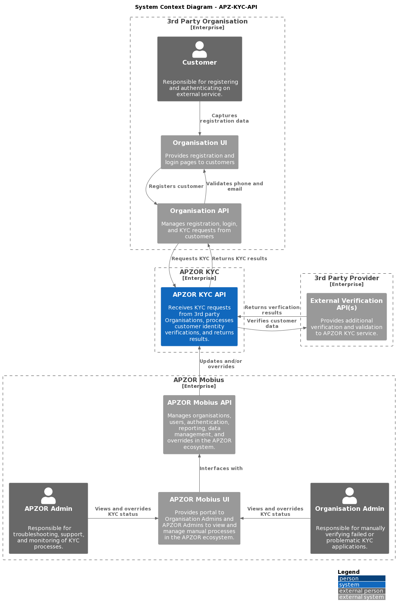

# Apzor Know-Your-Customer API

## Description

<p>
The Apzor Know-Your-Customer API (apz-kyc-api) is a RESTful API that provides a sevice for organisations to perform various security checks and verifications on their customers. These verifications are both internal and external, and allow the calling organisation to determine if their customer is who they claim to be with a high degree of certainty.
</p>
<p>
The customer is required to capture certain identity information, upload supporting documents, and perform facial recognition tests.
The automated verification process then checks this information for inconsistencies.
If all checks pass, the customer is considered "verified". If one or more checks fail, the customer is considered "not verified", and a manual (visual) verfication is requested. If all checks pass, but one or more warnings are genereated, a manual verfication is again requested.
</p>
<p>
Note: The front-end managment for this product is handled by the Mobius Portal.
</p>




## Tech Stack

- Operating System: Linux
- Framework: NEST JS
- Data Storgage: DynamoDB
- Infrastructure: Terragrunt
- Monitoring: TBA
- Cloud Platform: AWS
  - ECR
  - ECS
  - CloudWatch
  - SecretsManager
  - DynamoDB
  - S3
  - Rekognition

## Architecture

- [Context](https://github.com/adminapzor/apz-kyc-api/tree/main/docs/C4-Architecture/1_Context)
- [Containers](https://github.com/adminapzor/apz-kyc-api/tree/main/docs/C4-Architecture/2_Containers)
- [Components](https://github.com/adminapzor/apz-kyc-api/tree/main/docs/C4-Architecture/2_Components)
- [Code](https://github.com/adminapzor/apz-kyc-api/tree/main/docs/C4-Architecture/4_Code)

## Getting started

Clone this project from GitHub, then install the following requirements:

- [NVM](https://github.com/nvm-sh/nvm#installing-and-updating)
- [NODE JS](https://nodejs.org/en/learn/getting-started/how-to-install-nodejs)
- [NEST JS](https://docs.nestjs.com/first-steps)
- [AWS CLI](https://docs.aws.amazon.com/cli/latest/userguide/getting-started-install.html)
- [Docker](https://docs.docker.com/engine/install/)

Open this project from your code editor, then run this command in the terminal from the project root:
```bash
$ npm install
```

## Local Debugging

Local (partial) debugging can be performed by launching a LocalStack container (to emulate AWS), seeding the local database, then attaching the debugger through VSCode.
Note: AWS's Rekognition service is not available in LocalStack, so any facial recognition or liveness checks cannot be done locally!

- Set the environment variables:
```bash
$ cp .env.loc .env
```
- Build the project:
```bash
$ npm run build
```
- Launch LocalStack container and seed the local database:
```bash
$ docker-compose up
```
- To run the service as a local instance, select "Debug apz-kyc-api" from the "RUN AND DEBUG" drop-down within VSCode, then press "F5". 
- Add break-points to your code as required.
- Trigger the API endpoints using Curl or the example [Postman collections](https://github.com/adminapzor/apz-kyc-api/tree/main/docs/Postman-Collections).

## Remote Debugging

Remote (full) debugging can be performed by connecting to the QA environment, then attaching the debugger through VSCode.

- Set the environment variables:
```bash
$ cp .env.qa .env
```
- Build the project:
```bash
$ npm run build
```
- To run the service as a local instance whilst connected to the QA environment, select "Debug apz-kyc-api" from the "RUN AND DEBUG" drop-down within VSCode, then press "F5". 
- Add break-points to your code as required.
- Trigger the API endpoints using Curl or the example [Postman collections](https://github.com/adminapzor/apz-kyc-api/tree/main/docs/Postman-Collections).

## Testing

```bash
# unit tests
$ npm run test

# e2e tests (requires LocalStack container to be spun up)
$ npm run test:e2e

# test coverage
$ npm run test:cov
```

## Deployment

All deployment operations are managed in [GitHub Actions](https://github.com/adminapzor/apz-kyc-api/actions).

## Support

- For support, please contact [Hooligan Development](https://hooligan.co.za/contact-us)

- [API endpoint documentation](https://api.kyc.qa.tenettechnology.co.za/api-docs#/)